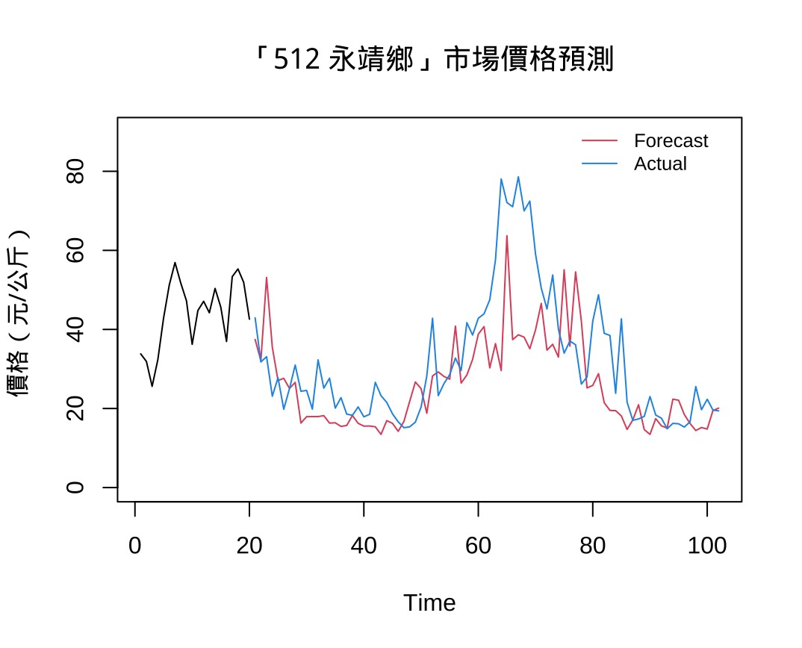
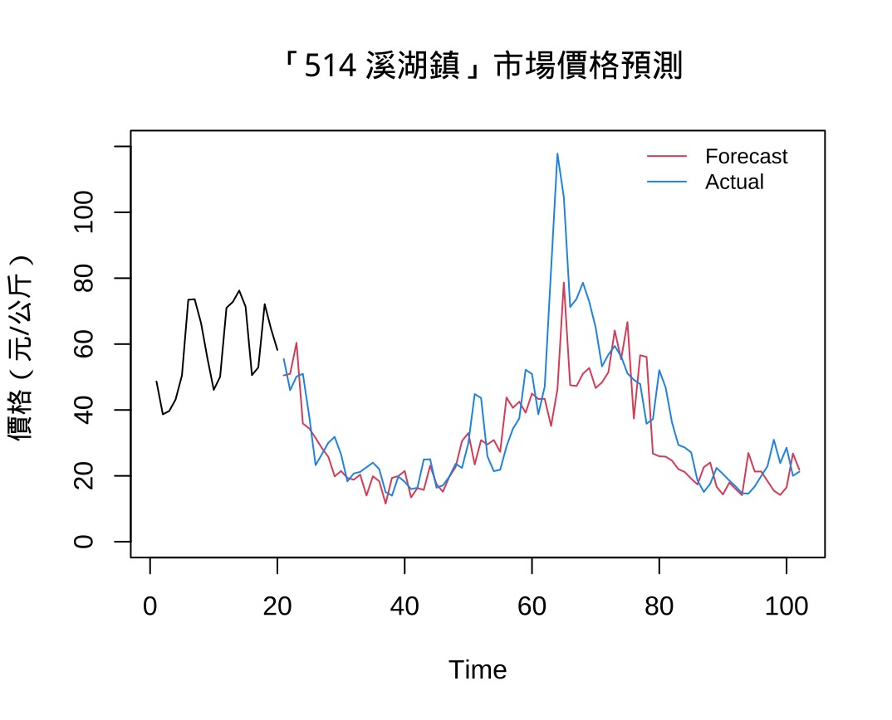
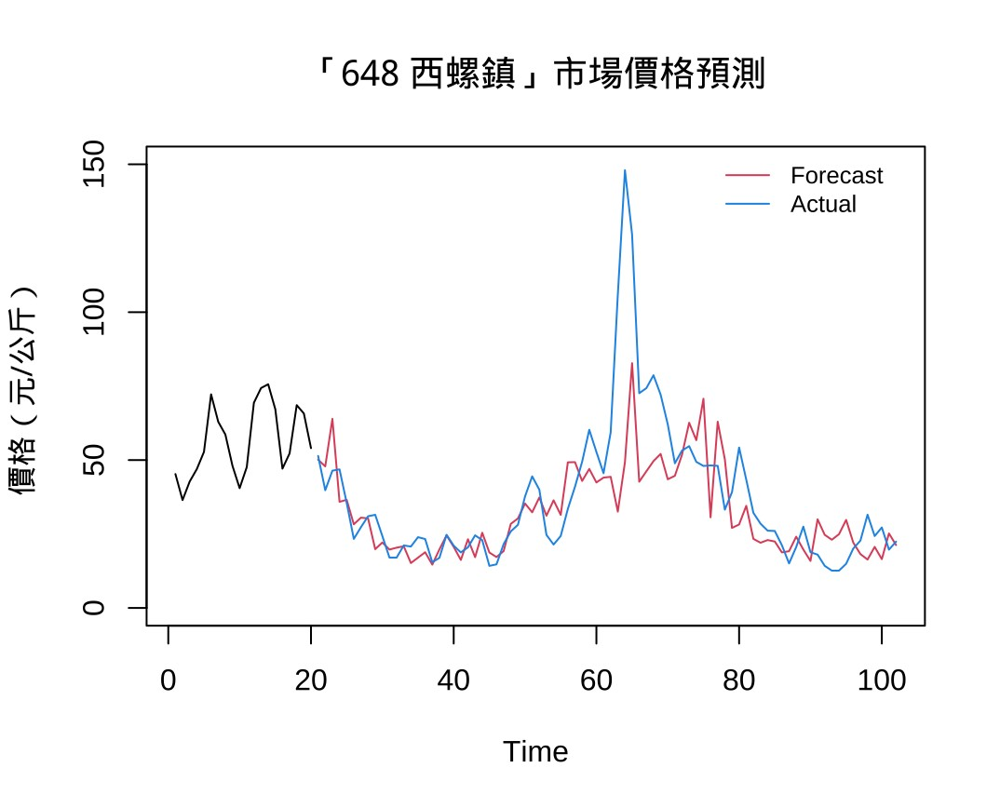
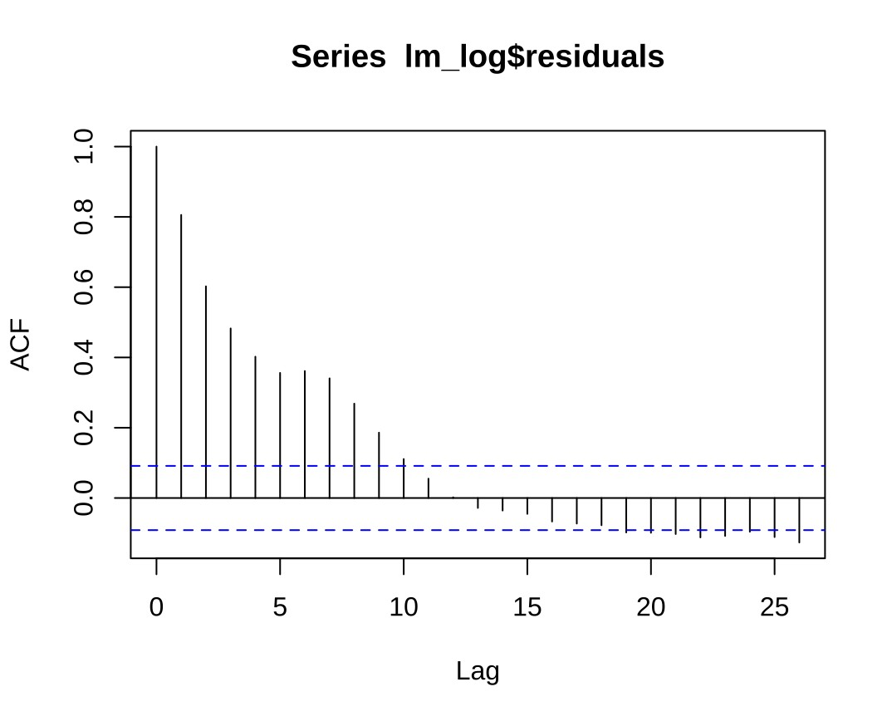
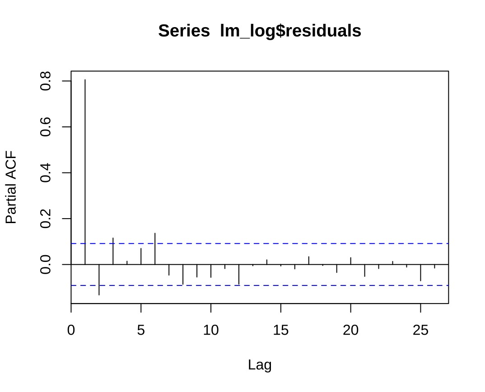
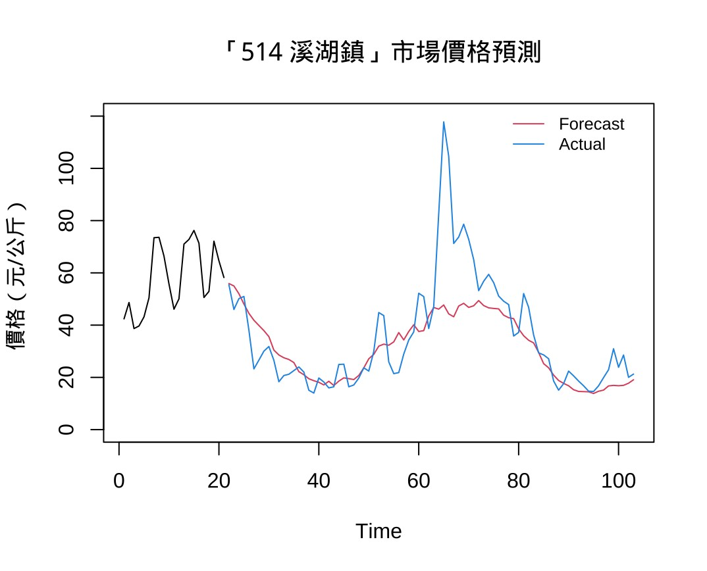
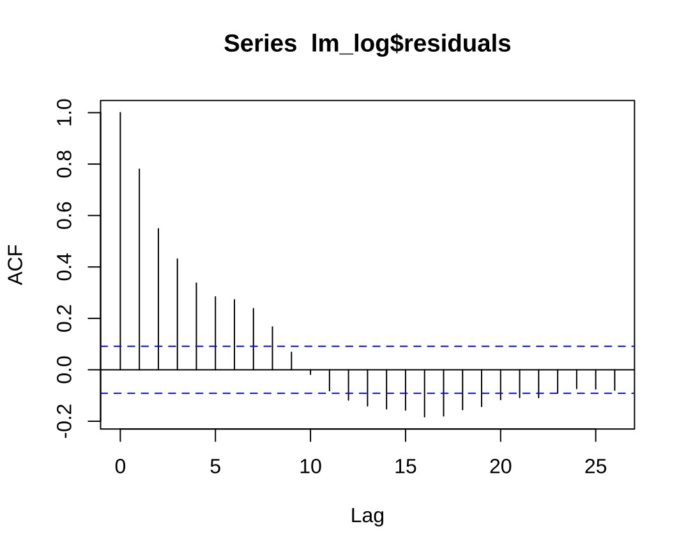
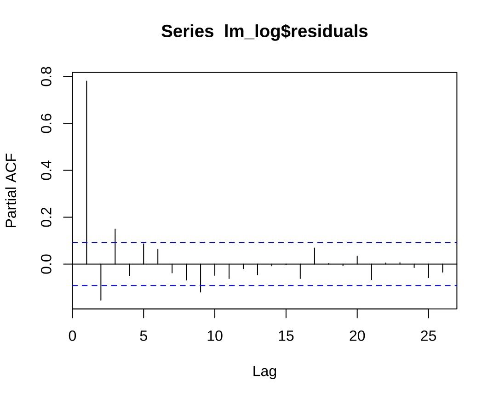
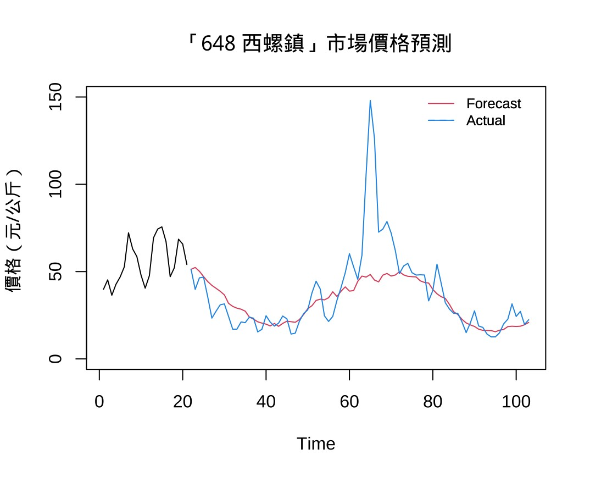
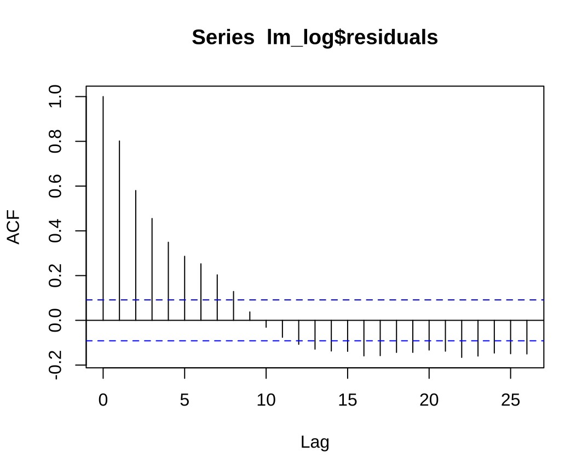

# 📈 Data Science Final Project: 台灣蔬菜價格與天氣資料分析

---

## 📚 目錄（Table of Contents）

* [📊 Data Collection](#-data-collection)

  * [🥬 農產品價格資料](#-農產品價格資料)
  * [🌤️ 天氣觀測資料](#-天氣觀測資料)
  * [🗺️ 產地與觀測站分布圖](#-產地與觀測站分布圖)
  * [🔗 參考資料來源](#-參考資料來源)
* [🔄 Data Integration](#-data-integration)

  * [🧾 最終資料欄位說明](#-最終資料欄位說明)
  * [⚠️ 注意事項](#️-注意事項)
  * [📁 資料參考檔案](#-資料參考檔案)
* [🖼️ 圖像成果展示](#️-圖像成果展示)

  * [📍 每週市場價格趨勢圖](#-每週市場價格趨勢圖)
  * [🔧 模型預測結果圖](#-模型預測結果圖)

    * [🧠 XGBoost 預測結果](#-xgboost-預測結果各市場)
    * [📈 ARIMA 預測與診斷圖](#-arima-預測與診斷圖)
  * [📂 圖像儲存路徑與結構](#-圖像儲存路徑與結構)

---

## 📊 Data Collection

### 🥬 農產品價格資料

- **資料來源**：農產品批發市場交易行情站  
  🔗 [https://amis.afa.gov.tw/veg/VegProdDayTransInfo.aspx](https://amis.afa.gov.tw/veg/VegProdDayTransInfo.aspx)
- **收集期間**：2015/01/01 ~ 2025/04/30
- **收集品項**：花椰菜（青梗）、茼蒿、甜豌豆

| 品種    | 日資料筆數 | 週資料筆數 |
|---------|------------|-------------|
| 花椰菜  | 14,983     | 764         |
| 茼蒿    | 4,091      | 764         |
| 甜豌豆  | 4,228      | 764         |

---

### 🌤️ 天氣觀測資料

- **資料來源**：農業氣象觀測網監測系統  
  🔗 [https://agr.cwa.gov.tw/history/station_day](https://agr.cwa.gov.tw/history/station_day)
- **收集期間**：2014/10/01 ~ 2025/04/30

#### 對應蔬菜與觀測站

由於僅有部分觀測站從 2014 年即開始提供完整資料，因此選定以下觀測站進行分析：

| 品種    | 觀測站地點                | 生育日數 |
|---------|---------------------------|-----------|
| 花椰菜  | 台中農改、南改斗南分場   | 60 天     |
| 茼蒿    | 台中農改、南改斗南分場   | 45 天     |
| 甜豌豆  | 台中農改、南改斗南分場   | 90 天     |

---

### 🗺️ 產地與觀測站分布圖

📍 [點此查看地理分布互動地圖](https://www.google.com/maps/d/u/0/edit?mid=1ReIEOk9rDv4Jogp6OP7GNVv825XCBh0&usp=sharing)

---

### 🔗 參考資料來源

| 主題             | 連結 |
|------------------|------|
| 食農教育資訊整合平台 | [點此前往](https://fae.moa.gov.tw/map/county_agri.php) |
| 花椰菜產地說明     | [台中區農改場](https://www.tcdares.gov.tw/theme_data.php?theme=news&sub_theme=event&id=13643) |
| 茼蒿產地說明      | [美食網](https://food.ltn.com.tw/article/1282) |
| 豌豆產地報導      | [農傳媒](https://www.agriharvest.tw/archives/73963) |

---

## 🔄 Data Integration

### 🧾 最終資料欄位說明

最終整合資料為每週單位，欄位分為三類：

#### 📌 基本資訊
- 市場
- 年份（year）
- 週次（week）
- 上價 / 中價 / 下價 / 平均價（元/公斤）
- 交易量（公斤）
- 品項（蔬菜種類）

#### 🌡️ 氣象特徵（每週 w-{n}，n=0~12）
| 類別       | 欄位名稱                                           |
|------------|----------------------------------------------------|
| 氣壓       | 平均氣壓(hPa)、日最高氣壓(hPa)、日最低氣壓(hPa)    |
| 氣溫       | 平均氣溫(℃)、最高氣溫(℃)、最低氣溫(℃)             |
| 露點/濕度  | 平均露點溫度(℃)、平均相對溼度(%)、最低相對溼度(%) |
| 風速       | 平均風速(m/s)、最大陣風風速(m/s)                   |
| 降雨       | 累計雨量(mm)、最大10分鐘降水量(mm)、最大60分鐘降水量(mm) |
| 日照       | 累積日照時數(hr)、累積日射量(MJ/m²)                |
| 地溫       | 平均地溫：5cm、10cm、20cm、50cm、100cm（單位：℃）  |

> 📌 每個氣象欄位會加上後綴 `_w-{n}`，代表該週往前第 n 週的數據（n = 0~12）

---

### ⚠️ 注意事項

- 累積型（sum）欄位較容易出現缺值（NA）。因為平均值在處理缺值時較具彈性，但累積值缺失過多會導致明顯誤差。因此若該週資料缺失超過兩日，該欄直接記為 NA。
- 最大降雨量欄位在部分年份並無資料，可斟酌是否納入模型訓練。

---

### 📁 資料參考檔案

- `data.ipynb`：資料整合與處理過程紀錄
- `summary_merged_daily_lagged.csv`：每日整合資料摘要
- `summary_merged_weekly_lagged.csv`：每週整合資料摘要

---

## 🖼️ 圖像成果展示

本研究依據各模型預測與區域市場資料，繪製多張可視化圖表，輔助理解價格波動趨勢與模型效果。

---

### 📍 每週市場價格趨勢圖

觀察各地市場（永靖鄉、溪湖鎮、西螺鎮）在不同週次的實際價格波動情形：

#### 永靖鄉


#### 溪湖鎮


#### 西螺鎮


#### 各市場平均價格比較
  


---

### 🔧 模型預測結果圖

#### 🧠 XGBoost 預測結果（各市場）

##### 永靖鄉


##### 溪湖鎮


##### 西螺鎮


---

#### 📈 ARIMA 預測與診斷圖

##### 永靖鄉（512）
  
  
  
  
  


---

##### 溪湖鎮（514）
  
  
  
  
  


---

##### 西螺鎮（648）
  
  
  
  
  


---

#### 🌲 Ranger 預測結果圖

##### 【甜豌豆】台中市（400）


---

##### 【甜豌豆】豐原區（420）


---

##### 【甜豌豆】溪湖鎮（514）


---

##### 【茼蒿】台中市（400）


---

##### 【茼蒿】豐原區（420）


---

##### 【茼蒿】西螺鎮（648）


---

### 📂 圖像儲存路徑與結構

```css
image/
├── 512永靖鄉每週批發價格趨勢圖.jpg
├── 514溪湖鎮每週批發價格趨勢圖.jpg
├── 648西螺鎮每週批發價格趨勢圖.jpg
├── 不同市場每周平均價格趨勢.jpg
├── 不同市場每周平均價格趨勢2.jpg
├── xgboost/
│   ├── 512市場價格預測_xgboost.jpg
│   ├── 514市場價格預測_xgboost.jpg
│   └── 648市場價格預測_xgboost.jpg
└── arima/
│   ├── [512系列圖]
│   ├── [514系列圖]
│   └── [648系列圖]
└── ranger/
    ├── 400台中市甜豌豆市場價格預測_ranger.jpg
    ├── 420豐原區甜豌豆市場價格預測_ranger.jpg
    ├── 514溪湖鎮甜豌豆市場價格預測_range.jpg
    ├── 400台中市茼蒿市場價格預測_ranger.jpg
    ├── 420豐原區茼蒿市場價格預測_ranger.jpg
    └── 648西螺鎮茼蒿市場價格預測_range.jpg
```

> 📌 本資料夾圖片為模型訓練與預測成果、各市場實際價格走勢視覺化之重要補充，建議搭配資料分析結果一同參閱。
